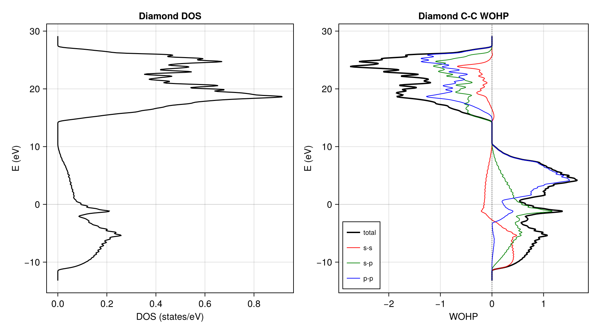
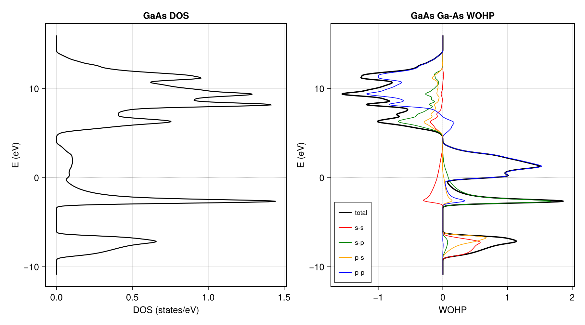
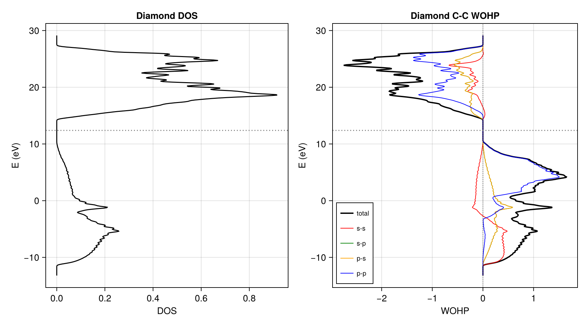

# Examples

## Diamond — Wannier90 route

[`examples/110_diamond_w90.jl`](https://github.com/hsugawa8651/CrystalBonds.jl/blob/main/examples/110_diamond_w90.jl)

Minimal example using only CrystalBonds.jl.
Reads a pre-computed `diamond_hr.dat` file (2 C atoms, sp3, 8 Wannier functions)
and computes WOHP on a 30x30x30 k-mesh.

- Left: total DOS from WOOP
- Right: C-C bond WOHP with orbital decomposition (s-s, s-p, p-p)



Bonding (positive WOHP) dominates below the band gap,
antibonding (negative) above. The p-p contribution is the largest.
IpCOHP is evaluated at the mid-gap energy.

## GaAs — Wannier90 route

[`examples/120_gaas_w90.jl`](https://github.com/hsugawa8651/CrystalBonds.jl/blob/main/examples/120_gaas_w90.jl)

GaAs with HGH pseudopotentials (isolated s-p bands, no disentanglement needed).
Orbital decomposition shows the heteropolar nature of the Ga-As bond:
s-p and p-s contributions are distinct due to different atomic character.



## Diamond — DFTK.jl + Wannier.jl pipeline

[`examples/210_diamond_dftk_pbe.jl`](https://github.com/hsugawa8651/CrystalBonds.jl/blob/main/examples/210_diamond_dftk_pbe.jl)

Full DFT-to-WOHP pipeline in Julia:

1. DFT calculation with [DFTK.jl](https://github.com/JuliaMolSim/DFTK.jl) (PBE, 8x8x8 k-grid, Ecut=30 Ha)
2. Wannierization with [Wannier.jl](https://github.com/qiaojunfeng/Wannier.jl)
3. Build tight-binding Hamiltonian ``H(\mathbf{R})``
4. Interpolate to fine k-mesh and compute WOHP with CrystalBonds.jl



In this example, the Fermi energy from the DFT calculation (`scfres.εF`)
is used directly for IpCOHP integration.

Requires additional packages:

```julia
using Pkg
Pkg.add(["DFTK", "PseudoPotentialData", "Wannier", "CairoMakie"])
```

## Running examples

From the CrystalBonds.jl root directory:

```sh
julia --project=. examples/110_diamond_w90.jl
```

See [`examples/000examples.md`](https://github.com/hsugawa8651/CrystalBonds.jl/blob/main/examples/000examples.md)
for the naming convention and full list.

!!! note "Energy origin"
    CrystalBonds.jl does not shift the energy axis. The energy scale depends
    on the input `_hr.dat` file. See [Theory — Energy unit and origin](@ref Energy-unit-and-origin)
    for details.
